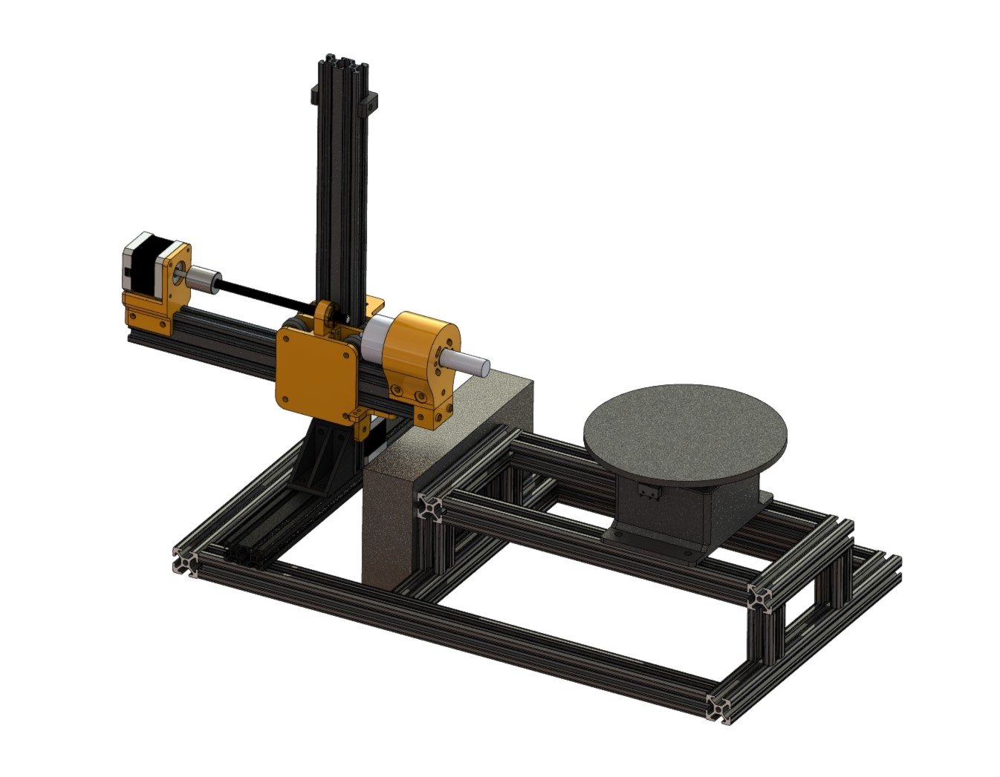
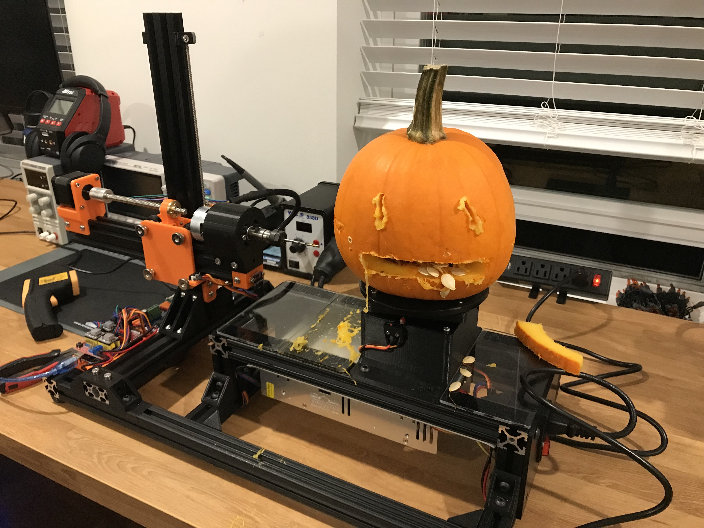
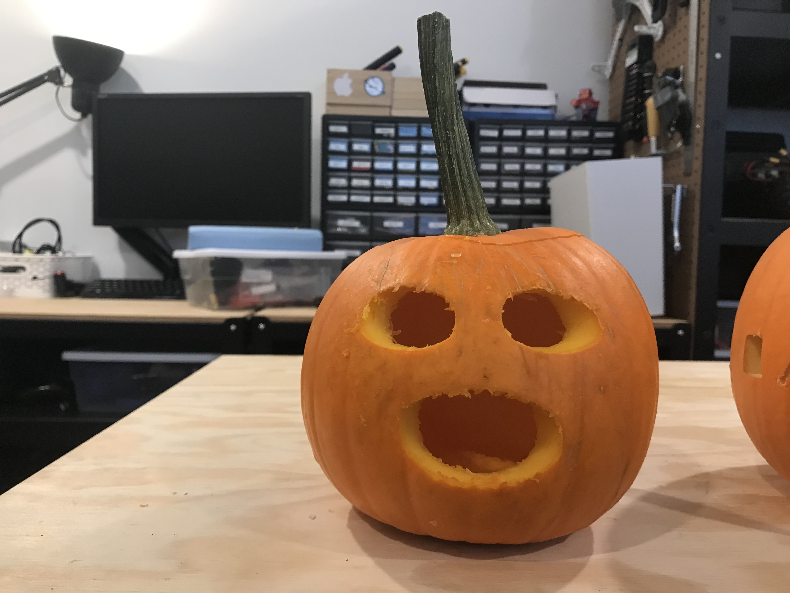

# Pumpkin Carving Robot

A robot that carves pumpkins! This robot is a Grbl-based CNC machine that uses a rotary table mechanism to cut patterns in pumpkins. It was built in October 2021 by [Andrew Gutierrez](http://andrewtgutierrez.com/) and [Chris Dalke](https://www.chrisdalke.com/). Results ranged from hilariously bad to pretty cool!

This repository holds the Solidworks CAD files for the machine, and python scripts to generate the GCode from an input image. We built this project in a rush as a one-off build, so this project is far from a reproducable build, but all the files are here.

